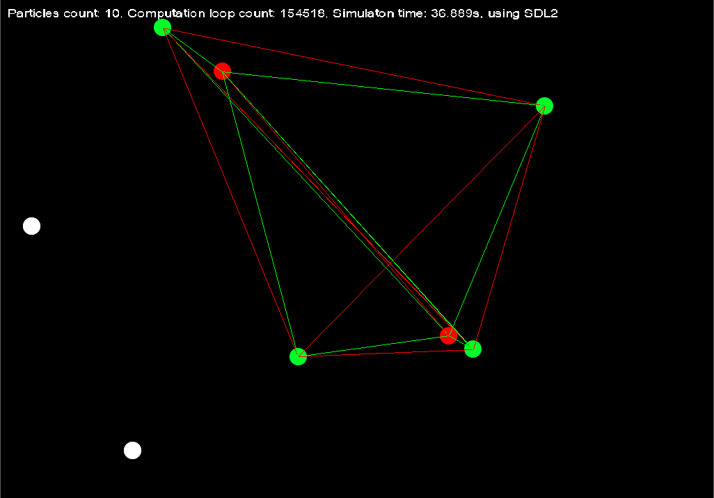

# Project Status

The project is still under moderate development, so far the exact direction of it isn't know. It can quickly change aspect as it can stay as it is for months.

# Dependencies

The project has been developed using SDL 2, for more information about installation and what it is you can [check it here](https://www.libsdl.org/download-2.0.php).

# Description

**This project is just a poor attempt of applying a couple of basic electrostatics principles, that have a n-body-simulation-alike feeling. Nothing is accurately coded or represented.**

In this simulation you have 3 distinct types of elementary particles, negatively charged ones *(red dots)*, positiviely charged ones *(green dots)* and neutrally charged particles *(white dots)*.

The colors of the lines represent the attraction between the two bodies. *Green* line signifies that the bodies are attracted to eachother, *red* line means that the bodies are repulsing eachother. Once two bodies collide they cancel eachother becoming a netural particle. Since in this simulation a neutral particles have no sense of charge, they're entirely stationary.

# Preview

This is how a simulation with initially 10 particles launched looks like.

# Known bugs & caveats

- The text rendering is very choppy.
- The physics of the simulation is completely inaccurate.
- Computation algorithm can potentially be improved.
